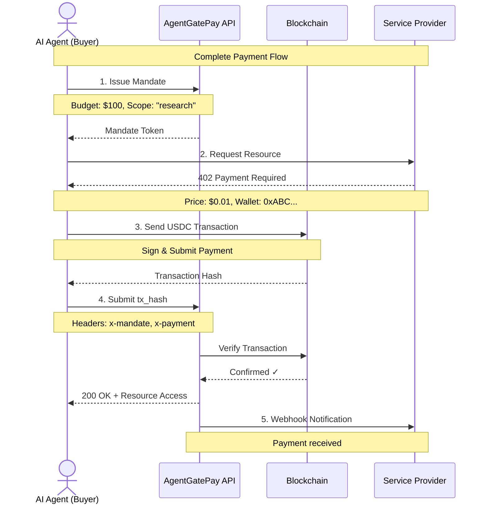
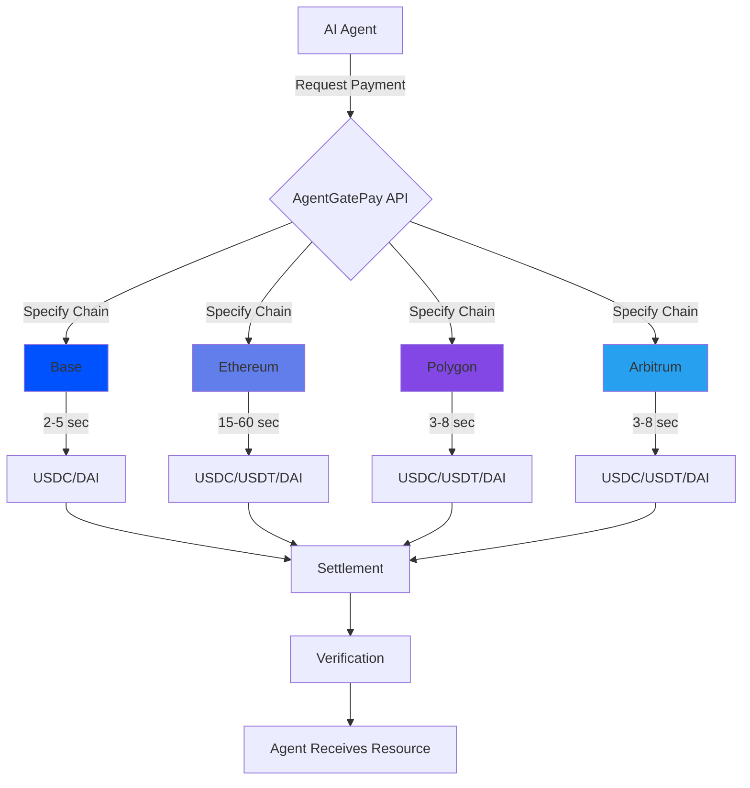
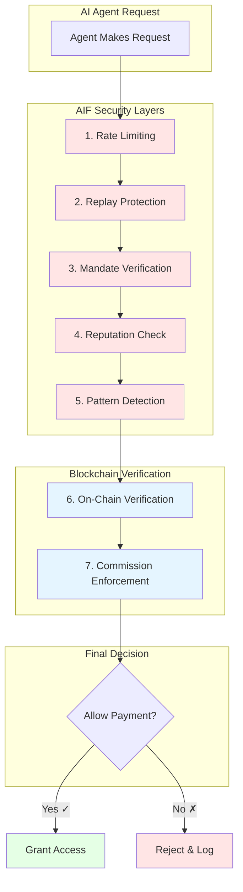
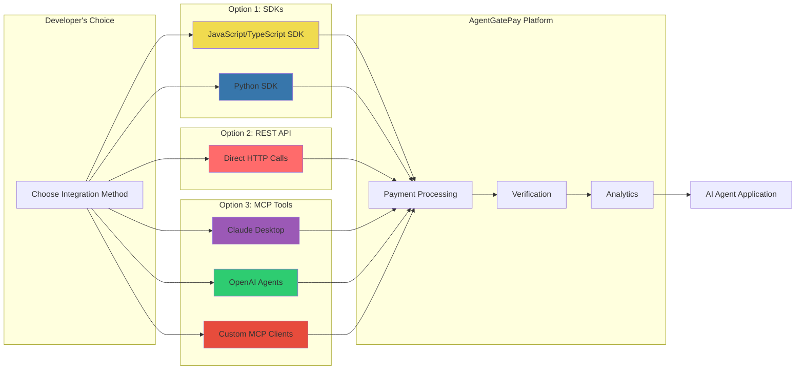
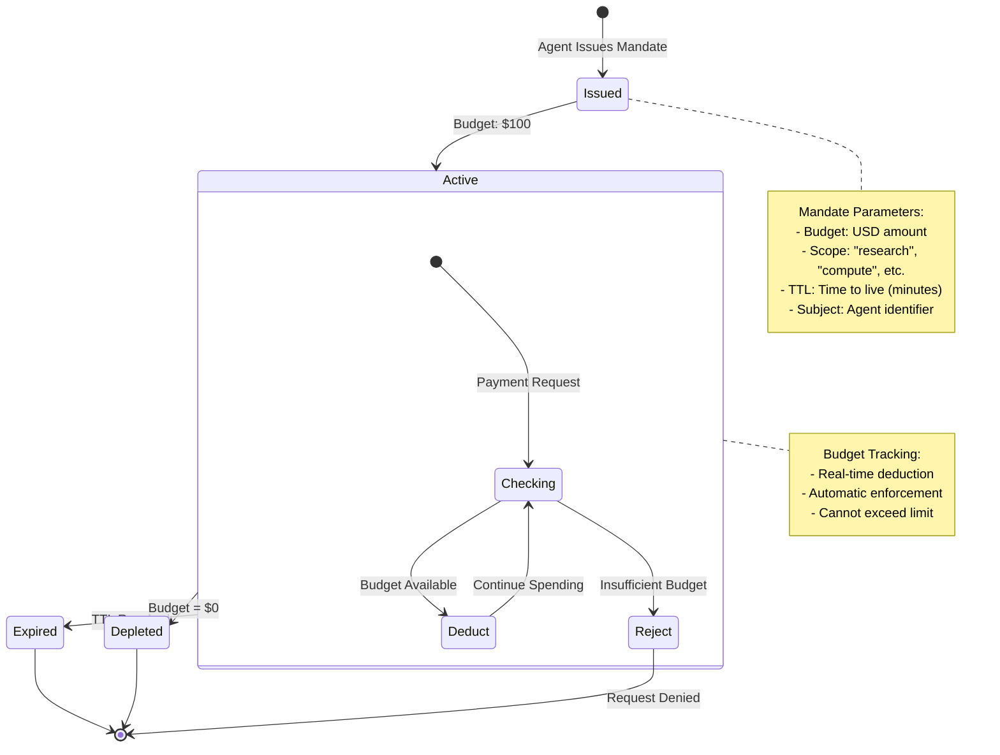
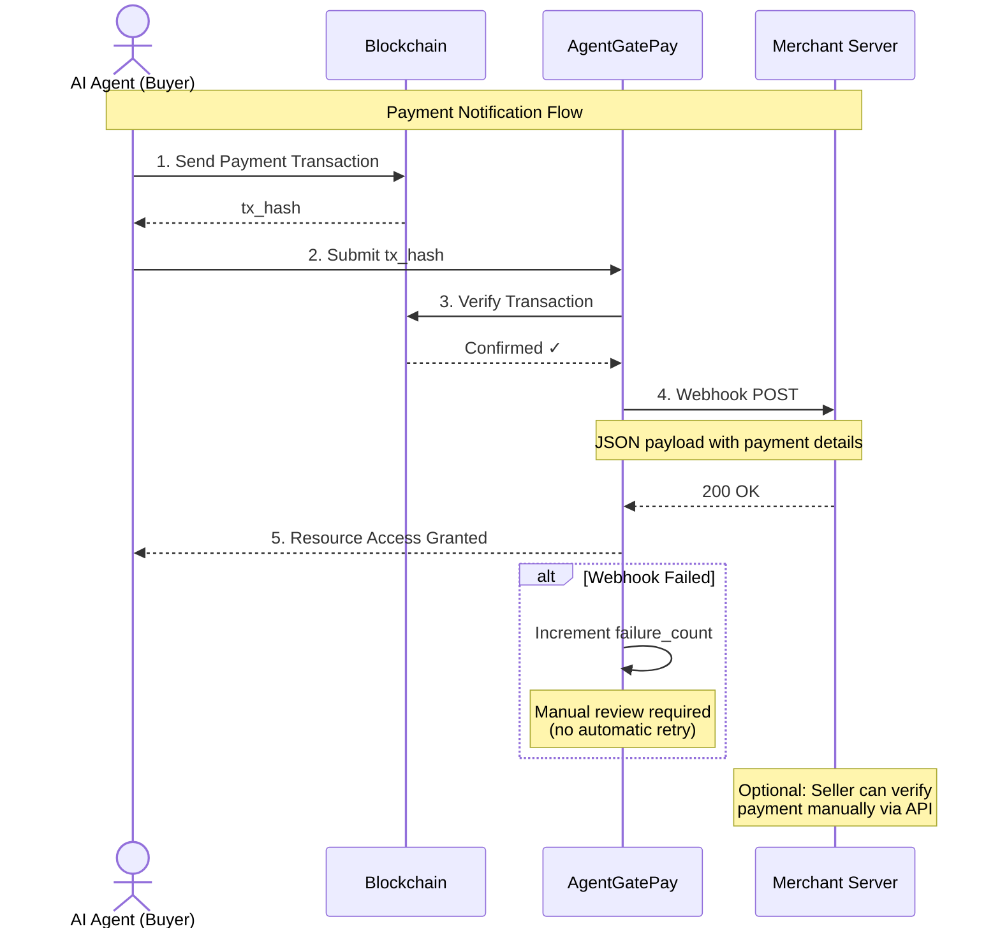
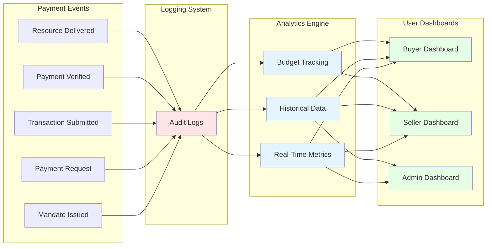
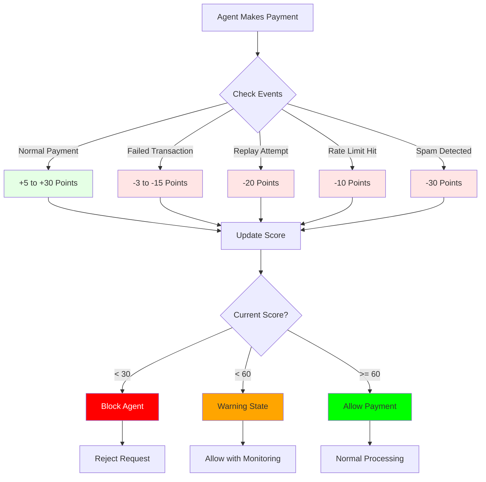
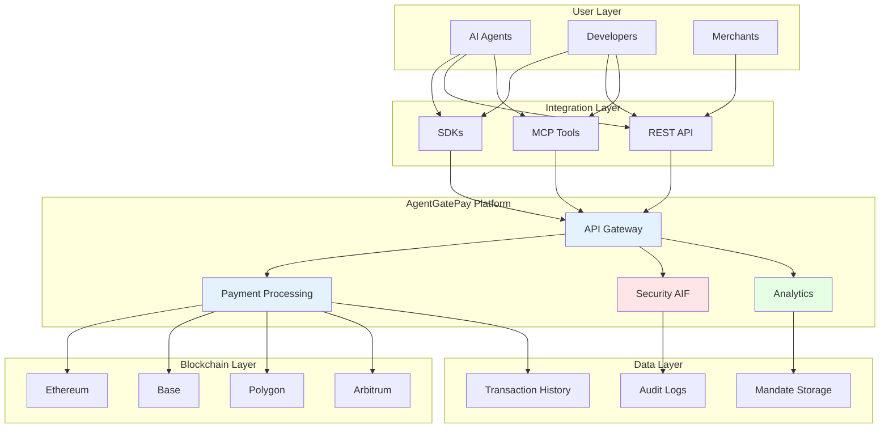

# AgentGatePay Architecture Diagrams

**Public-facing conceptual diagrams** for understanding how AgentGatePay works.

**Current Version:** Beta v0.9.0 | **Last Updated:** December 2025

**Note:** These diagrams show high-level concepts and user-facing flows only. Internal implementation details are not shown for security reasons.

---

## 1. Payment Flow Overview

### Agent-to-Agent Payment (x402 Protocol)

---

## 2. Multi-Chain Architecture

### How Chain Selection Works

**Key Points:**
- Agents choose chain via query parameters: `?chain=base&token=USDC`
- Different chains have different settlement speeds
- AgentGatePay verifies transactions on-chain for all chains
- Multi-token support varies by chain

---

## 3. Security Layers (AIF)

### Agent Interaction Firewall Protection

**Security Features:**
1. **Rate Limiting** - Prevents abuse (20-100 req/min depending on endpoint)
2. **Replay Protection** - Each transaction can only be used once
3. **Mandate Verification** - Budget and scope enforcement
4. **Reputation Check** - Agent behavior scoring (0-200)
5. **Pattern Detection** - Suspicious activity monitoring
6. **On-Chain Verification** - Blockchain transaction confirmation
7. **Commission Enforcement** - Automatic 0.5% fee collection

---

## 4. Integration Options

### How Developers Connect to AgentGatePay

**Integration Comparison:**

| Method | Setup Time | Best For | Language Support |
|--------|------------|----------|------------------|
| **SDK** | 10 minutes | Production apps, type safety | JavaScript, Python |
| **REST API** | 15 minutes | Any language, full control | Any |
| **MCP Tools** | 5 minutes | Claude/OpenAI agents | Framework-agnostic |

---

## 5. Mandate (Budget Control) Flow

### How AP2 Mandates Work

**Key Concepts:**
- **Mandate** = Pre-authorized spending limit for agents
- **Budget** = Maximum USD amount agent can spend
- **Scope** = What agent is allowed to purchase
- **TTL** = How long mandate remains valid
- **Automatic Enforcement** = Gateway rejects payments exceeding budget

---

## 6. Transaction Signing Options

### Client-Side vs. Server-Side Signing

```mermaid
graph TD
    subgraph "Option 1: Client-Side Signing"
        A1[AI Agent] -->|Has Private Key| B1[Sign Transaction]
        B1 --> C1[Submit to Blockchain]
        C1 --> D1[Get tx_hash]
        D1 --> E1[Send to AgentGatePay]
        E1 --> F1[Verification Only]
    end

    subgraph "Option 2: TX Signing Service"
        A2[AI Agent] -->|API Call| B2[TX Service]
        B2 -->|API Key Check| C2[Authorized?]
        C2 -->|Yes| D2[Sign Transaction]
        D2 --> E2[Submit to Blockchain]
        E2 --> F2[Return tx_hash]
        F2 --> G2[Send to AgentGatePay]
        G2 --> H2[Verification]
    end

    style A1 fill:#E3F2FD
    style B1 fill:#E3F2FD
    style C1 fill:#E3F2FD
    style D1 fill:#E3F2FD
    style E1 fill:#E3F2FD
    style F1 fill:#E3F2FD

    style A2 fill:#FFF3E0
    style B2 fill:#FFF3E0
    style C2 fill:#FFF3E0
    style D2 fill:#FFF3E0
    style E2 fill:#FFF3E0
    style F2 fill:#FFF3E0
    style G2 fill:#FFF3E0
    style H2 fill:#FFF3E0
```

**Comparison:**

| Aspect | Client-Side | TX Service |
|--------|-------------|------------|
| **Security** | Keys in client code (risk) | Keys isolated on server (safer) |
| **Complexity** | Manage wallets per agent | Simple API call |
| **Commission** | Trust client enforcement | Server-enforced (guaranteed) |
| **Best For** | Trusted environments | Production deployments |

---

## 7. Webhook Notification Flow

### How Sellers Get Notified

**Webhook Benefits:**
- Real-time payment notifications
- Automatic seller notification (no polling required)
- Failure tracking for monitoring
- Signature verification for security

---

## 8. Audit & Analytics Flow

### Transaction Tracking

**What's Tracked:**
- Every mandate issuance
- All payment requests
- Transaction submissions
- Verification outcomes
- Budget deductions
- Commission collection
- Webhook deliveries

**Access Levels:**
- **Buyer** - See spending, mandate budget remaining, payment history
- **Seller** - See revenue, payment confirmations, webhook logs
- **Admin** - See system-wide metrics, security events, performance

---

## 9. Reputation System (AIF)

### Agent Behavior Scoring

**Reputation Mechanics:**
- **Starting Score:** 100 (neutral)
- **Maximum Score:** 200 (excellent)
- **Minimum Score:** 0 (blocked)
- **Decay:** Scores naturally increase over time if no violations
- **Manual Reset:** Admin can reset false positives

**Point Distribution:**
- **Normal Payment:** +5 to +30 points (based on transaction amount)
- **Failed Transaction:** -3 to -15 points (based on chain/token)
- **Replay Attempt:** -20 points (security violation)
- **Rate Limit Hit:** -10 points (abuse prevention)
- **Spam Detected:** -30 points (severe violation)

**Agent States:**
- **Blocked (< 30)** - Cannot make payments, requires manual review
- **Warning (< 60)** - Extra monitoring, stricter limits
- **Good (61-100)** - Normal operation
- **Excellent (101-200)** - Trusted agent, potential perks

---

## 10. System Components Overview

### High-Level Architecture

**Component Responsibilities:**

| Component | Purpose |
|-----------|---------|
| **API Gateway** | Entry point for all requests |
| **Payment Processing** | Transaction verification & settlement |
| **Security (AIF)** | Rate limiting, replay protection, reputation |
| **Analytics** | Real-time metrics & historical tracking |
| **Blockchain Layer** | Multi-chain transaction submission & verification |
| **Data Layer** | Persistent storage for mandates, logs, history |

---

## Additional Resources

- **[API Reference](../api/endpoints-reference.md)** - Complete endpoint documentation
- **[Buyer Quickstart](../quickstart/buyer-guide.md)** - Getting started with payments
- **[Seller Quickstart](../quickstart/merchant-guide.md)** - Getting started with receiving
- **[MCP Tools](../mcp/tools-reference.md)** - AI agent integration

---

**Note:** These diagrams show conceptual flows and public-facing components only. Internal infrastructure details (databases, servers, code modules) are not shown for security reasons.

**Last Updated:** December 2025
**Diagrams Version:** 1.0.0
**Format:** Mermaid.js (GitHub-rendered)
